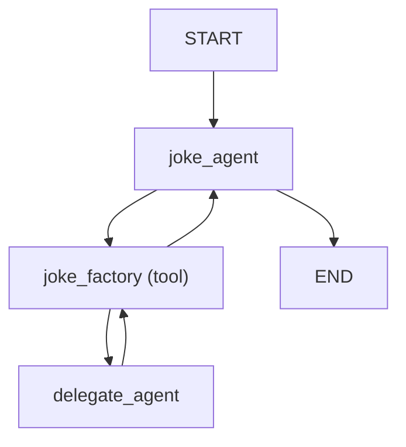
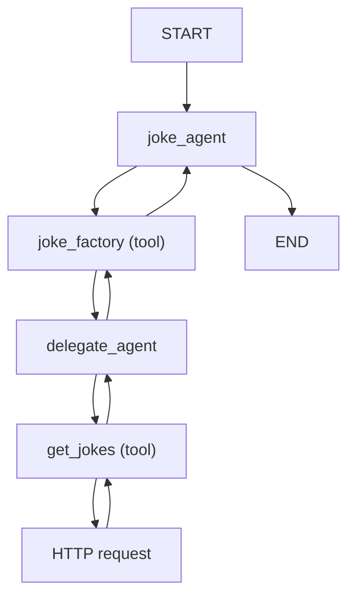

# Multi-agent Applications

There are roughly four levels of complexity when building applications with PydanticAI:

1. Single agent workflows — what most of this documentation covers
2. [Agent delegation](#agent-delegation) — agents using another agent via tools
3. [Programmatic agent hand-off](#programmatic-agent-hand-off) — one agent runs, then application code calls another agent
4. [Graph based control flow](#pydanticai-graphs) — for the most complex cases, graph and a state machine can be used to control the execution of multiple agents

Of course, you can combine multiple strategies in a single application.

## Agent Delegation

The agent delegates work to another agent, but then takes back control when that agent finishes.

Since agents are stateless and designed to be global, you do not need to include the agent itself in agent [dependencies](dependencies.md).

When doing so, you'll generally want to pass [`ctx.usage`][pydantic_ai.RunContext.usage] to the [`usage`][pydantic_ai.Agent.run] keyword argument of delegate agent (the agent called from within a tool) run so usage within that run counts towards the total usage of a parent agent run.

!!! Multiple models
    Agent delegation doesn't need to use the same model for each agent. If you choose to use different models within a run, calculating the monetary cost from the final [`result.usage()`][pydantic_ai.result.RunResult.usage] of the run will not be possible, but you can still use [`UsageLimits`][pydantic_ai.usage.UsageLimits] to avoid unexpected costs.

```python {title="agent_delegation_simple.py"}
from pydantic_ai import Agent, RunContext
from pydantic_ai.usage import UsageLimits

joke_agent = Agent(
    'openai:gpt-4o',
    system_prompt=(
        'Use the "joke_factory" to generate some jokes, then choose the best. '
        'You must return just a single joke.'
    ),
)


@joke_agent.tool
async def joke_factory(ctx: RunContext, count: int) -> list[str]:
    r = await delegate_agent.run(f'Please generate {count} jokes.', usage=ctx.usage)
    return r.data


delegate_agent = Agent('gemini-1.5-flash', result_type=list[str])

result = joke_agent.run_sync(
    'Tell me a joke.', usage_limits=UsageLimits(request_limit=5, total_tokens_limit=300)
)
print(result.data)
#> Did you hear about the toothpaste scandal? They called it Colgate.
print(result.usage())
"""
Usage(
    requests=3, request_tokens=204, response_tokens=24, total_tokens=228, details=None
)
"""
```

_(This example is complete, it can be run "as is")_

The control flow for this example is pretty simple and can can be summarised as follows:



### Agent Delegation and dependencies.

The delegate agent needs to either have the same [dependencies](dependencies.md) as the calling agent, or dependencies which are a subset of the calling agent's dependencies.

```python {title="agent_delegation_deps.py"}
from dataclasses import dataclass

import httpx

from pydantic_ai import Agent, RunContext


@dataclass
class ClientAndKey:  # (1)!
    http_client: httpx.AsyncClient
    api_key: str


joke_agent = Agent(
    'openai:gpt-4o',
    deps_type=ClientAndKey,  # (2)!
    system_prompt=(
        'Use the "joke_factory" tool to generate some jokes on the given subject, '
        'then choose the best. You must return just a single joke.'
    ),
)


@joke_agent.tool
async def joke_factory(ctx: RunContext, count: int) -> list[str]:
    r = await delegate_agent.run(
        f'Please generate {count} jokes.',
        deps=ctx.deps,  # (3)!
        usage=ctx.usage,
    )
    return r.data


delegate_agent = Agent(
    'gemini-1.5-flash',
    deps_type=ClientAndKey,  # (4)!
    result_type=list[str],
    system_prompt=(
        'Use the "get_jokes" tool to get some jokes on the given subject, '
        'then extract each joke into a list.'
    ),
)


@delegate_agent.tool  # (5)!
async def get_jokes(ctx: RunContext[ClientAndKey], count: int) -> str:
    response = await ctx.deps.http_client.get(
        'https://example.com',
        params={'count': count},
        headers={'Authorization': f'Bearer {ctx.deps.api_key}'},
    )
    response.raise_for_status()
    return response.text


async def main():
    async with httpx.AsyncClient() as client:
        deps = ClientAndKey(client, 'foobar')
        result = await joke_agent.run('Tell me a joke.', deps=deps)
        print(result.data)
        #> Did you hear about the toothpaste scandal? They called it Colgate.
        print(result.usage())  # (6)!
        """
        Usage(
            requests=4,
            request_tokens=310,
            response_tokens=32,
            total_tokens=342,
            details=None,
        )
        """
```

1. Define a dataclass to hold the client and API key dependencies.
2. Set the `deps_type` of the calling agent.
3. Pass the dependencies to the delegate agent's run method within the tool call.
4. Also set the `deps_type` of the delegate agent.
5. Define a tool on the delegate agent that uses the dependencies to make an HTTP request.
6. Usage now includes 4 requests — 2 from the calling agent and 2 from the delegate agent.

_(This example is complete, it can be run "as is")_

The control flow for this example shows how even a fairly simple agent delegation leads to a fairly complex flow:



## Programmatic agent hand-off

Multiple agents are called in succession, with application code responsible for deciding which agent to call next.

## PydanticAI Graphs

This is a work in progress and not yet documented, see [#528](https://github.com/pydantic/pydantic-ai/issues/528) and [#539](https://github.com/pydantic/pydantic-ai/issues/539)

## Examples

The following examples demonstrate how to use dependencies in PydanticAI:

- [Flight booking](examples/flight-booking.md)
